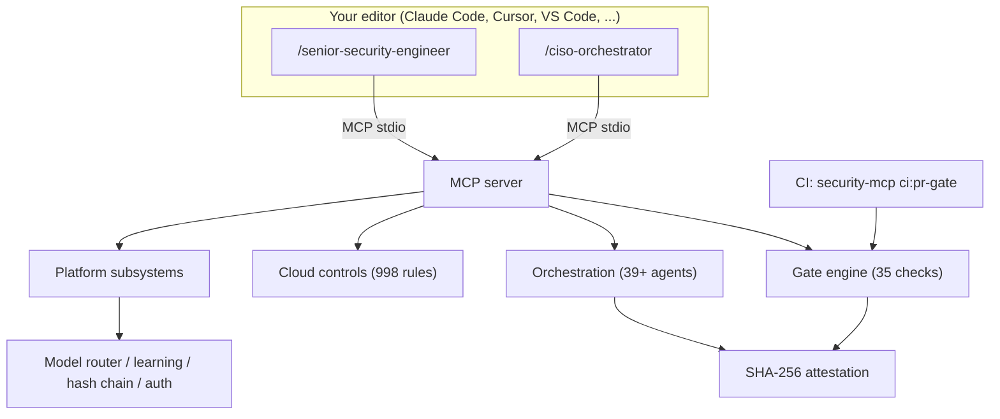
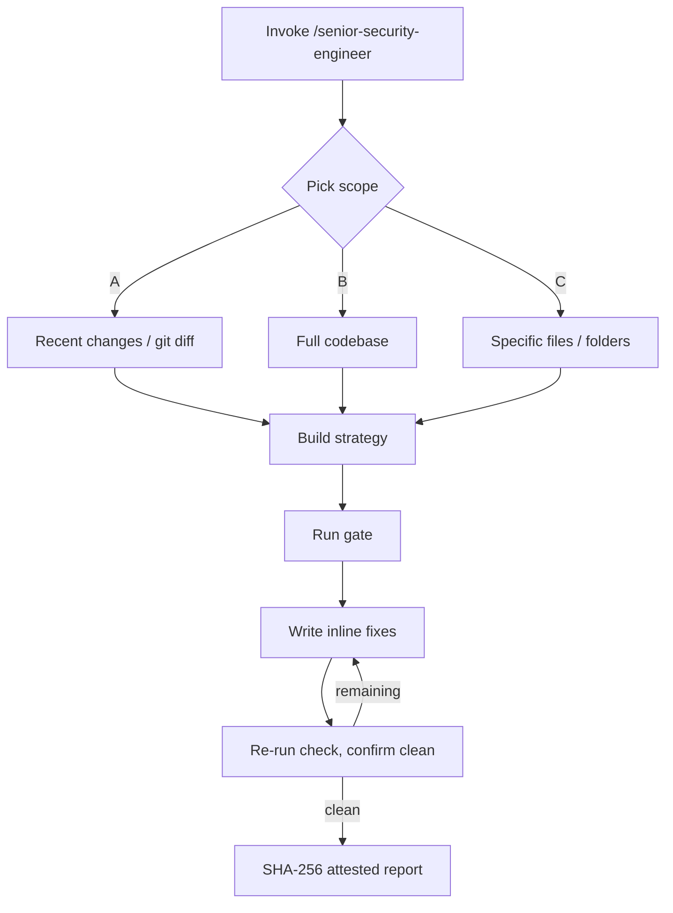
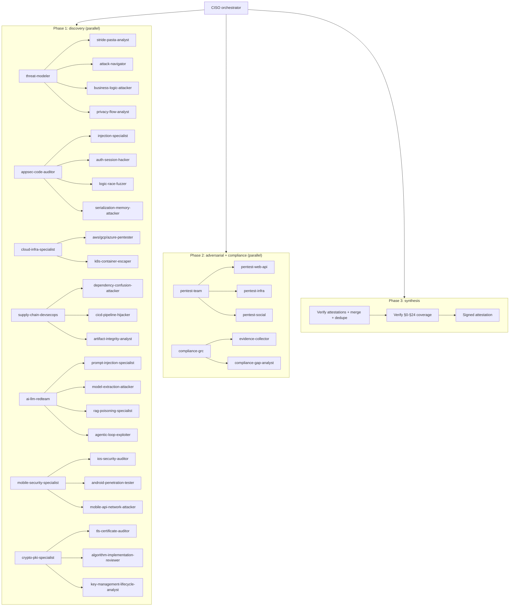
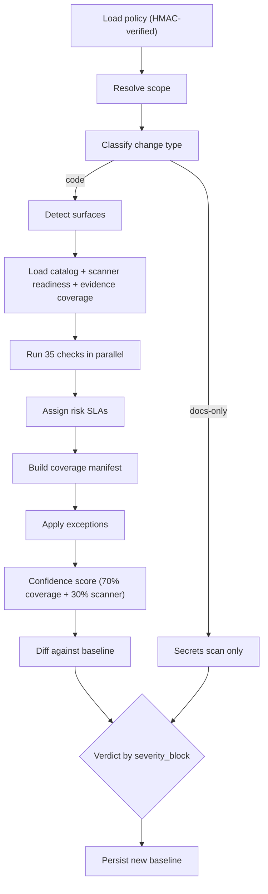
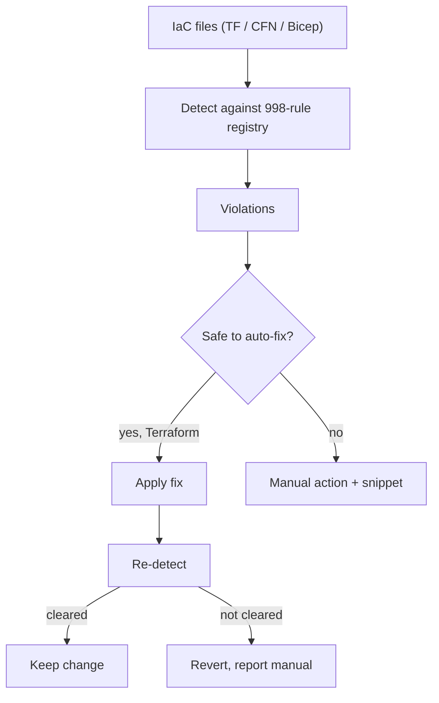

# security-mcp

[](https://www.npmjs.com/package/security-mcp)
[](LICENSE)
[](https://nodejs.org)
[](https://github.com/AbrahamOO/security-mcp/actions)

An autonomous application-security engineering layer for AI-assisted development.

security-mcp is a [Model Context Protocol](https://modelcontextprotocol.io) server that turns your AI coding assistant into a security engineer that does the work, not a linter that files tickets. It reads code the way an attacker does, writes the secure fix inline, and enforces a gate in CI so insecure code cannot merge. The operating mandate across the product is the same one a strong security hire would hold: roughly 90% fixing, 10% advisory.

Platform and security teams can standardize their entire AppSec program on it. A solo founder can install it in a minute and ship safer code on day one. No security background is required to benefit, but nothing is dumbed down for the people who have one.

Works with Claude Code, Cursor, VS Code / GitHub Copilot, Windsurf, Codex, Replit, and any MCP-compatible editor.

```bash
npx -y security-mcp@latest install
```

---

## Table of Contents

- [Why this exists](#why-this-exists)
- [What's new in 1.3.2](#whats-new-in-132)
- [System overview](#system-overview)
- [The two entry points](#the-two-entry-points)
  - [/senior-security-engineer](#senior-security-engineer)
  - [/ciso-orchestrator](#ciso-orchestrator)
- [The gate engine](#the-gate-engine)
- [Cloud security controls engine](#cloud-security-controls-engine)
- [Install](#install)
- [CI/CD gate](#cicd-gate)
- [Built for teams](#built-for-teams)
- [Self-protection and supply-chain posture](#self-protection-and-supply-chain-posture)
- [MCP tools](#mcp-tools)
- [Frameworks](#frameworks)
- [Policy and exceptions](#policy-and-exceptions)
- [Environment variables](#environment-variables)
- [The 10 non-negotiable rules](#the-10-non-negotiable-rules)
- [CLI reference](#cli-reference)
- [Documentation and disclosure](#documentation-and-disclosure)
- [License](#license)

---

## Why this exists

Most security tooling stops at detection. It produces a list, hands it to a human, and waits. That model breaks down when AI assistants are writing the majority of the code, because the volume of change outpaces anyone's ability to triage a backlog by hand.

security-mcp inverts the default. When it finds a vulnerability it writes the production-ready fix into your working tree, re-runs the check to confirm the issue cleared, and only then moves on. The same engine runs as a deterministic gate in CI, so the contract is simple: HIGH and CRITICAL findings do not merge.

You get three things from one install:

- An interactive security engineer that fixes code inside your editor.
- A multi-agent security program that runs a full audit on demand.
- A standalone CI gate that needs no AI session to enforce the line.

---

## What's new in 1.3.2

**Cloud security controls engine.** A registry-driven engine that scans infrastructure-as-code against 998 rules mapped to AWS FSBP, CIS Benchmarks (AWS / GCP / Azure), and the Microsoft Cloud Security Benchmark, across Terraform, CloudFormation, and Bicep. Terraform violations can be auto-remediated with `security-mcp autoharden`. See [the dedicated section](#cloud-security-controls-engine).

**Two new CLI commands.** `security-mcp ci:pr-gate` runs the gate directly from `npx` and exits non-zero on HIGH/CRITICAL. `security-mcp sign-policy` HMAC-signs the active policy so tampering is detected at gate startup.

**The tool hardened itself.** An unsigned policy can no longer relax the gate to PASS (severity_block is floored to HIGH/CRITICAL). An unsigned exceptions file can no longer suppress HIGH/CRITICAL by default. Attestation refuses to sign anything that is not a clean PASS. There is a fully offline mode, a checksum-verified installer with no `curl | sh` path, and data at rest is written with `0o600` permissions. Details in [self-protection and supply-chain posture](#self-protection-and-supply-chain-posture).

Earlier releases expanded the deep-analysis pattern libraries (injection, authentication, supply chain, business logic), brought OWASP Top 10 to full coverage, and wired the industry scanners into the gate.

---

## System overview



The MCP server is the trust root. Both entry-point skills, the standalone CI gate, and every supporting subsystem call into the same engine, so an interactive fix and a CI verdict are produced by identical logic.

---

## The two entry points

You drive security-mcp through two skills. One is your daily security engineer. The other is a full security program you run when the stakes are high.

| | `/senior-security-engineer` | `/ciso-orchestrator` |
| --- | --- | --- |
| Shape | One elite engineer agent | 39 named agents, 40+ at runtime |
| Best for | Every PR, targeted hardening | Pre-release audits, compliance prep |
| Scope | You pick: diff, full codebase, or specific paths | Full: every surface, every framework |
| Speed | Seconds to minutes | Minutes to hours |
| Output | Inline fixes + SHA-256 attested report | Merged findings, compliance mapping, signed attestation |
| Network | Not required | Optional live threat intel |

Rule of thumb: run `/senior-security-engineer` on every PR, and `/ciso-orchestrator` before a release or an audit.

### /senior-security-engineer

A single elite security-engineer agent. It operates 90% fixing, 10% advisory: it writes the secure code rather than handing you a report to act on. You pick the scope at the start (recent changes via git diff, the full codebase, or specific files and folders), and it runs a strategy pass, then the gate, then inline fixes, and finishes with a SHA-256 attested report you can keep as an audit artifact.

This is the daily driver. Use it on every PR.



### /ciso-orchestrator

A full security program in one command, held to the same 90% fixing, 10% advisory mandate as the single agent: every specialist writes the fix rather than filing a finding. Nine specialist lead agents command 30 sub-agents, for 39 named agents in the static spawn tree. At runtime the orchestrator dynamically spawns additional ghost and coverage agents based on cross-domain findings, so a real run typically fields 40 or more. It draws on a registry of 91 specialist skills (registry version 1.6.0), loaded on demand based on your detected stack, and covers PCI DSS 4.0, SOC 2, ISO 27001, NIST 800-53, HIPAA, and GDPR mapping.

It runs in three phases:

1. **Discovery (parallel).** Seven leads run at once: threat modeling, AppSec code audit, cloud and infrastructure, supply chain, AI/LLM red team, mobile, and crypto/PKI.
2. **Adversarial and compliance (parallel).** A penetration-test team reads Phase 1's threat model as its attack brief, while a compliance/GRC synthesizer maps findings to controls.
3. **Synthesis.** Each agent's findings file is schema-validated and verified against that agent's signed attestation before it is trusted, then findings are merged and deduplicated, SKILL.md section coverage (§0 through §24) is verified, and a signed attestation is written. A tampered attestation chain or a findings-hash mismatch forces the gate to FAIL.



Cloud, AI/LLM, and mobile sub-agents are conditional: they activate only when the relevant stack is detected, and report N/A otherwise.

---

## The gate engine

The gate is the deterministic core. On every run it executes 35 security checks in parallel (33 distinct check modules plus 2 precomputed coverage feeds). It is surface-aware: it first detects which surfaces a change touches (web, API, infrastructure, iOS, Android, AI/LLM, agentic) and runs the relevant checks against them.



A crashed check module never disappears quietly. It becomes a HIGH coverage-gap finding, so the absence of a result is itself a result. A control that regresses from satisfied to missing against the saved baseline also becomes a HIGH finding.

### Deep-analysis modules

| Module | Patterns | What it targets |
| --- | --- | --- |
| Deep injection | 42 | SQL/NoSQL, SSTI, SpEL/OGNL, deserialization, CRLF, SSRF, and more |
| Deep authentication | 43 | JWT confusion, session and OAuth flaws, weak hashing, token entropy |
| Deep supply chain | 32 | Obfuscated payloads, malicious scripts, exfiltration channels |
| Business logic | 31 | IDOR, race conditions, payment and e-commerce abuse |
| Data platform | 47 | Databricks and Snowflake misconfiguration |
| Deep Docker | 49 | Container build and runtime hardening |
| GitOps | 41 | ArgoCD and Flux pipeline integrity |
| Agentic-instruction integrity | 11 | Poisoned AI agent instruction files |
| AI governance | 3 | Shadow-AI and data-to-LLM exfiltration |

Alongside these, the gate runs Kubernetes (70 checks), IaC (56), and dedicated modules for secrets, dependencies, crypto, web/Next.js, API, mobile (iOS and Android), GraphQL, database, DLP, SBOM, an incident-response playbook, runtime/DAST, CI pipeline hardening, and a Nuclei DAST integration.

### Scanner orchestration and threat intel

When they are present on the host, the gate orchestrates industry scanners: gitleaks, semgrep, trivy, osv-scanner, checkov, conftest, and zaproxy. Their results fold into the same findings model.

Live threat intelligence (cached for 24 hours) enriches the verdict: CISA KEV, EPSS (a score above 0.5 escalates severity), OpenSSF Scorecard, and the npm registry. Set `SECURITY_OFFLINE=1` to disable all third-party egress. Private and internal scoped package names are never sent to public endpoints, online or off.

---

## Cloud security controls engine

A registry-driven engine scans infrastructure-as-code against 998 rules mapped to AWS Foundational Security Best Practices (FSBP), CIS Benchmarks for AWS, GCP, and Azure, and the Microsoft Cloud Security Benchmark.

| Coverage | Rules |
| --- | --- |
| AWS | 483 |
| Azure | 320 |
| GCP | 195 |
| Terraform / HCL | 774 |
| CloudFormation | 128 |
| Bicep | 96 |



Terraform supports auto-remediation through `security-mcp autoharden` (use `--dry-run` to preview). The engine applies a fix, re-detects to confirm the violation actually cleared, and only then keeps the change. Anything it cannot safely auto-fix is reported as a manual action with a code snippet.

---

## Install

Prerequisite: Node.js 20 or higher (`node --version`).

```bash
npx -y security-mcp@latest install
```

The installer auto-detects Claude Code, Cursor, VS Code, and Windsurf, and writes the config to the right place. Restart your editor, then run a review:

```text
/senior-security-engineer
```

For a full audit:

```text
/ciso-orchestrator
```

Confirm the install is healthy at any time:

```bash
npx -y security-mcp@latest doctor
```

### Manual config

Add the server to your editor's MCP config and restart.

Claude Code (`~/.claude/settings.json`), Cursor (`~/.cursor/mcp.json`), Windsurf (`~/.windsurf/mcp.json`):

```json
{
  "mcpServers": {
    "security-mcp": {
      "command": "npx",
      "args": ["-y", "security-mcp@latest", "serve"]
    }
  }
}
```

VS Code / GitHub Copilot (user `settings.json`):

```json
{
  "mcp.servers": {
    "security-mcp": {
      "command": "npx",
      "args": ["-y", "security-mcp@latest", "serve"]
    }
  }
}
```

---

## CI/CD gate

The gate runs as plain Node.js with no AI session involved, so it belongs in your pipeline as a required check.

```bash
npx -y security-mcp@latest ci:pr-gate
```

It exits non-zero on HIGH or CRITICAL findings.

### GitHub Actions

Create `.github/workflows/security-gate.yml`:

```yaml
name: Security Gate

on:
  pull_request:
    branches: [main]

jobs:
  security-gate:
    runs-on: ubuntu-latest
    steps:
      - uses: actions/checkout@v4
        with:
          fetch-depth: 0          # required for git diff

      - uses: actions/setup-node@v4
        with:
          node-version: '20'

      - name: Block insecure code from merging
        run: npx -y security-mcp@latest ci:pr-gate
        env:
          GITHUB_TOKEN: ${{ secrets.GITHUB_TOKEN }}
```

### Optional HMAC integrity

To make the policy tamper-evident, add a repository secret named `SECURITY_POLICY_HMAC_KEY` that is at least 32 bytes, then sign and commit:

```bash
security-mcp sign-policy
```

Commit the policy file together with its generated `.hmac` sidecar. Once a key is set, the gate requires a valid signature on the policy, and a missing sidecar is rejected by design, so the key and the signature must land in the same change.

---

## Built for teams

Four platform subsystems let a security team operate security-mcp at scale, not just run it ad hoc.

**Multi-provider model router.** Cost-aware routing across model providers, with circuit breakers and a spend budget so a single provider outage or a runaway run cannot stall or overspend the program.

**Learning engine.** Remembers confirmed patterns and false positives per project, with rate-limited false-positive suppression so noise drops over time. Routing decisions are written to an ISO 42001 audit log.

**Tamper-evident attestation hash chain.** Each agent attestation is chained (`init_chain`, `attest_agent`, `verify_chain`, `get_chain`), so the audit trail cannot be silently rewritten after the fact.

**MCP caller authentication.** An optional shared-secret gate on the MCP channel uses constant-time HMAC comparison, a 3-strike lockout, and a session TTL (8 hours by default, capped at 24). When unset, the channel stays open for frictionless local use.

---

## Self-protection and supply-chain posture

A security tool is part of your supply chain, so security-mcp is built to resist the same attacks it looks for. This matters most when the threat is a malicious repository or a compromised dependency trying to neutralize the gate.

- **Signed policy, exceptions, and baseline.** These files are HMAC-signed. When the policy is not signed, the gate floors `severity_block` to HIGH/CRITICAL, so an unsigned edit cannot relax the gate to PASS.
- **Exceptions cannot quietly suppress.** By default an unsigned exceptions file may not suppress HIGH/CRITICAL findings. A break-glass env var exists for scanning intentionally-vulnerable fixtures.
- **Honest attestation.** Attestation refuses to sign unless the latest gate result is PASS with all required steps complete. There are no forged green attestations.
- **Verified inter-agent payloads.** The merge step that aggregates every agent's findings is the trust sink for a whole run, so it schema-validates each agent's findings file and checks its hash against that agent's signed attestation before trusting it. Findings dedupe keeps the highest severity per id, so a same-id low-severity entry cannot shadow a real CRITICAL. A tampered chain or a findings-hash mismatch forces FAIL. Set `SECURITY_REQUIRE_AGENT_ATTESTATION=1` to fail closed unless the run is HMAC-signed, fully attested, and clean — note that an *unsigned* attestation chain is only tamper-evident, not tamper-proof, against an attacker who can write the run directory, so the HMAC key is the real boundary.
- **Per-tool-call audit trail.** Every MCP tool call is logged as one structured JSONL record (timestamp, agent id, tool, inputs, output summary, session credential, outcome) to `.mcp/audit/tool-calls.jsonl`. Secret-bearing keys and secret-shaped values (in inputs and in the output preview) are scrubbed; failed auth attempts are recorded as such, not as successes; the log rotates at 50 MB and writing never interrupts a tool call. Set `SECURITY_TOOL_AUDIT_LOG` to forward to an append-only sink.
- **Locked-down data at rest.** Findings, agent memory, and signatures are written with `0o600` file permissions.
- **Prompt-injection defense.** Tool outputs that originate from the repo are sanitized before they reach an LLM.
- **Verified installer.** Downloaded scanner binaries are verified by SHA-256, unchecksummed binaries are refused, and there is no `curl | sh` install path.
- **Air-gap mode.** `SECURITY_OFFLINE=1` produces a fully offline run with no third-party egress.

---

## MCP tools

Your AI calls these automatically; you rarely invoke them by hand. There are around 40, grouped into three namespaces plus two MCP prompts.

### Most useful tools

| Tool | Purpose |
| --- | --- |
| `security.start_review` | Open a stateful review run and get a `runId` |
| `security.run_pr_gate` | Run the gate, return PASS/FAIL with findings |
| `security.attest_review` | Write a SHA-256 attestation (PASS-gated) |
| `security.threat_model` | STRIDE + PASTA + ATT&CK model for a surface |
| `security.scan_strategy` | Map every check to OWASP/NIST/ATT&CK controls |
| `security.generate_policy` | Generate a policy tailored to your stack |
| `security.terraform_hardening_blueprint` | Terraform hardening baseline + mappings |
| `security.generate_opa_rego` | OPA/Rego for plans, pipelines, admission |
| `security.generate_compliance_report` | Map findings to SOC 2, PCI, ISO, NIST, HIPAA, GDPR |
| `security.generate_remediations` | Concrete fix template per finding |
| `repo.read_file` / `repo.search` | Read or search the codebase (guarded) |
| `orchestration.create_agent_run` | Stand up the multi-agent run + manifest |
| `orchestration.merge_agent_findings` | Dedupe and sort findings across agents |
| `orchestration.verify_skill_coverage` | Check §0-§24 SKILL.md coverage |

### Operational families

Beyond the tools above, the rest of the surface clusters into four families:

- **Model routing and budget.** `get_routing`, `get_model_for_task`, `track_usage`, `model_budget_status`, `get_provider_health`, `record_provider_failure`, `reset_provider_circuit`.
- **Learning and pattern memory.** `record_outcome`, `pattern_report`, `self_heal_loop`, plus `orchestration.read_agent_memory` / `write_agent_memory`.
- **Attestation hash chain.** `init_chain`, `attest_agent`, `verify_chain`, `get_chain`.
- **Caller auth and lifecycle.** `authenticate`, `logout`, plus update tools `orchestration.check_updates` / `apply_updates` and skill loading `orchestration.ensure_skill`.

Namespace counts: `security.*` (29 tools), `repo.*` (2), `orchestration.*` (9), and 2 MCP prompts.

---

## Frameworks

Every finding and fix maps to recognized standards. You do not need to know them to benefit; they are there so your evidence stands up to an auditor.

| Domain | Standards |
| --- | --- |
| OWASP | Top 10 (Web + API), ASVS L2/L3, MASVS, Top 10 for LLMs, Testing Guide |
| MITRE | ATT&CK (Enterprise + Cloud + Mobile), D3FEND, ATLAS, CAPEC |
| NIST | 800-53 Rev 5, CSF 2.0, 800-207 Zero Trust, 800-218 SSDF, AI RMF, 800-131A |
| Compliance | PCI DSS 4.0, SOC 2 Type II, ISO 27001:2022 + 27002, ISO 42001:2023, GDPR / CCPA / HIPAA |
| Supply chain and cloud | SLSA Level 3, CIS Benchmarks L2, AWS FSBP, Microsoft Cloud Security Benchmark |
| Scoring | CVSS v4.0 + EPSS |

---

## Policy and exceptions

The policy lives at `.mcp/policies/security-policy.json`. Copy the default to start:

```bash
mkdir -p .mcp/policies
cp node_modules/security-mcp/defaults/security-policy.json .mcp/policies/security-policy.json
```

Exceptions live at `.mcp/exceptions/security-exceptions.json`. Each entry needs `id`, `finding_ids`, `justification`, `ticket`, `owner`, `approver` (the owner cannot be the approver), `approval_role`, and `expires_on` (within 365 days):

```json
{
  "version": "1.0.0",
  "exceptions": [
    {
      "id": "EX-001",
      "finding_ids": ["DEP_CVE_CVE-2024-12345"],
      "justification": "Library being replaced next sprint; no public exploit",
      "ticket": "JIRA-9999",
      "owner": "alice@example.com",
      "approver": "bob@example.com",
      "approval_role": "SecurityLead",
      "expires_on": "2026-12-31"
    }
  ]
}
```

Expired exceptions automatically become blocking findings until they are renewed or resolved.

---

## Environment variables

### Gate and scope

| Variable | Default | Purpose |
| --- | --- | --- |
| `SECURITY_GATE_POLICY` | `.mcp/policies/security-policy.json` | Policy file path |
| `SECURITY_GATE_MODE` | `recent_changes` | Scan mode |
| `SECURITY_GATE_TARGETS` | (changed files) | Comma-separated paths to restrict the scan |
| `SECURITY_GATE_BASE_REF` | `origin/main` | Branch to diff against |
| `SECURITY_GATE_HEAD_REF` | `HEAD` | Branch being scanned |
| `SECURITY_GATE_EXCEPTIONS` | (default path) | Exceptions file path |
| `SECURITY_GATE_SCANNERS` | built-in | Custom scanner config path |
| `SECURITY_GATE_EVIDENCE_MAP` | (none) | Evidence-coverage map path |
| `SECURITY_GATE_CONTROL_CATALOG` | (none) | Control-catalog path |

### Integrity and signing

| Variable | Purpose |
| --- | --- |
| `SECURITY_POLICY_HMAC_KEY` | Signs policy / exceptions / baseline (>=32 bytes) |
| `SECURITY_REQUIRE_SIGNED_EXCEPTIONS` | Fail closed on any unsigned exceptions file |
| `SECURITY_REQUIRE_AGENT_ATTESTATION` | Fail closed unless the agent run is signed + enforced + clean (see below) |
| `SECURITY_ALLOW_UNSIGNED_HIGH_SUPPRESSION` | Break-glass: allow unsigned HIGH/CRITICAL suppression |
| `SECURITY_ATTEST_ALLOW_INCOMPLETE` | Break-glass: attest without a complete PASS |
| `SECURITY_ATTEST_KEY` | Signs attestation files |
| `SECURITY_AUDIT_HMAC_KEY` | Signs the routing audit log and the per-agent attestation chain |

### Observability

| Variable | Default | Purpose |
| --- | --- | --- |
| `SECURITY_TOOL_AUDIT_LOG` | `.mcp/audit/tool-calls.jsonl` | Path for the per-tool-call structured audit log; point at an append-only / write-once sink for tamper-proof retention |

### Privacy and air-gap

| Variable | Purpose |
| --- | --- |
| `SECURITY_OFFLINE` | Disable all third-party network egress |

### MCP channel

| Variable | Default | Purpose |
| --- | --- | --- |
| `SECURITY_MCP_SHARED_SECRET` | (none) | Require caller auth on the MCP channel |
| `SECURITY_SESSION_TTL_MS` | 8h | Session lifetime, capped at 24h |

### Remediation

| Variable | Purpose |
| --- | --- |
| `SECURITY_AGENTIC_QUARANTINE` | Handling for poisoned agent files: `strip`, `sanitize`, `quarantine`, or `off` |

### Integrations

| Variable | Purpose |
| --- | --- |
| `SECURITY_SLACK_WEBHOOK` | Post gate results to Slack |
| `SECURITY_JIRA_URL` | Create Jira tickets for failures |
| `SECURITY_JIRA_TOKEN` | Jira API token (never logged) |
| `SECURITY_JIRA_PROJECT` | Jira project key (default `SECURITY`) |
| `SECURITY_PAGERDUTY_KEY` | Page on-call for CRITICAL findings |
| `SECURITY_WEBHOOK_URL` | POST gate results as JSON to any URL |

### Live scanning

| Variable | Purpose |
| --- | --- |
| `SECURITY_STAGING_URL` | Enable runtime + Nuclei DAST against staging |
| `SECURITY_AI_ENDPOINT` | Enable live AI red-team probes |
| `SECURITY_AUTO_SBOM` | Auto-generate a CycloneDX SBOM each run |

---

## The 10 non-negotiable rules

No matter what the AI is asked to build, these hold:

1. No `0.0.0.0/0` firewall rules. Ingress and egress are source-restricted.
2. Internal services live on a private VPC only, never on public IPs.
3. Secrets live in a secret manager only, never in code, `.env`, CI logs, or images.
4. TLS 1.3 for everything in transit. TLS 1.0 and 1.1 are blocked.
5. Passwords hashed with Argon2id, or bcrypt at cost 14 or higher.
6. Every API input validated server-side with a schema.
7. No inline JavaScript. Content Security Policy is nonce-based only.
8. Admin interfaces require FIDO2/WebAuthn.
9. Threat-model before any auth, payment, or AI feature.
10. Zero Trust: every request authenticated and authorized regardless of origin.

---

## CLI reference

The `security-mcp` binary exposes:

| Command | Purpose |
| --- | --- |
| `serve` | Run the MCP server |
| `install` | Install for auto-detected editors |
| `install-global` | Install globally |
| `config` | Manage configuration |
| `doctor` (alias `verify`) | Health check |
| `autoharden` | Auto-remediate Terraform (`--dry-run` to preview) |
| `ci:pr-gate` | Run the gate in CI (non-zero exit on HIGH/CRITICAL) |
| `sign-policy` | HMAC-sign the active policy |

---

## Documentation and disclosure

- **Deep-dive docs:** the [GitHub Wiki](https://github.com/AbrahamOO/security-mcp/wiki).
- **Contributing:** [CONTRIBUTING.md](CONTRIBUTING.md).
- **Reporting a vulnerability in security-mcp itself:** see [SECURITY.md](SECURITY.md), which uses GitHub private security advisories for responsible disclosure.

---

## License

[MIT](LICENSE)
