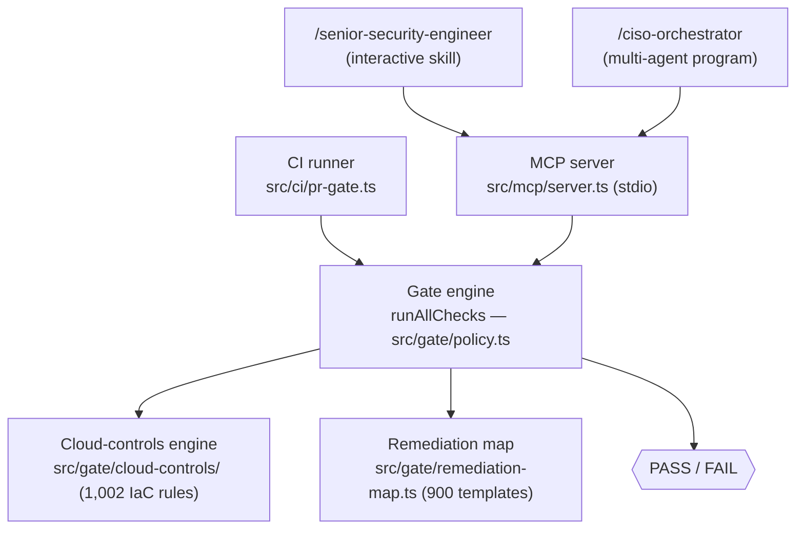
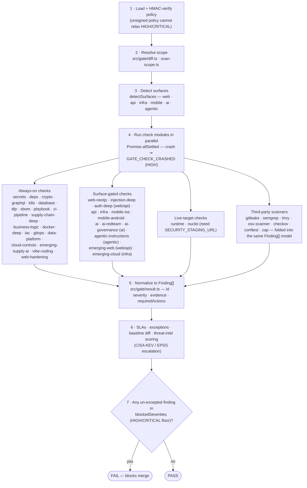
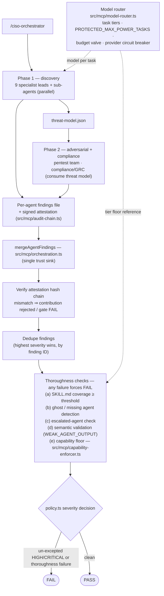

# Architecture

Last updated: 2026-07-17

> **Version note:** 1.4.0, 1.5.0, 1.6.0, and 1.6.1 referenced throughout this document
> are internal milestones that were never published to npm. All of them ship publicly in
> **1.3.5** (the first npm release after 1.3.4).

This document describes how security-mcp is put together internally: the gate engine's
data flow from source files to a PASS/FAIL verdict, the cloud-controls engine, the
multi-agent orchestration and attestation subsystem, model routing, the remediation map,
and where the 1.5.0 additions (three new check modules and the capability-enforcement
subsystem), the 1.6.0 addition (the always-on "vibe coding" module), and the 1.6.1
additions (the always-on "web-hardening" module and the remediation map reaching 100%
detection-ID coverage) fit into the existing pipeline. It assumes familiarity with the
product-level description in [README.md](../README.md); this doc goes one level deeper
into the code.

For a full list of 1.5.0, 1.6.0, and 1.6.1 rule IDs and a practical how-to reference, see
[WIKI.md](WIKI.md).

## Overview: one engine, two callers

The MCP server (`src/mcp/server.ts`) is the trust root. Both the interactive
`/senior-security-engineer` skill and the `/ciso-orchestrator` multi-agent program call
into the same gate engine through MCP tools, and the standalone CI runner
(`src/ci/pr-gate.ts`, invoked as `security-mcp ci:pr-gate`) calls the identical gate logic
directly, without an MCP session. This matters architecturally: there is exactly one
implementation of "is this change safe to merge," not one for the editor and a looser one
for CI. Whatever an agent fixes interactively, CI will verify with the same checks.



## The gate engine: checks to Finding[] to policy to result

The gate lives under `src/gate/`. Its entry point is `runAllChecks` in
`src/gate/policy.ts`.



A single gate run does the following, in order:

1. **Load and verify the policy.** The active policy (default
   `.mcp/policies/security-policy.json`) is read and, if `SECURITY_POLICY_HMAC_KEY` is
   set, its HMAC signature is verified. If the key is not set, the policy is still read,
   but the gate does not trust it to relax anything: `HIGH` and `CRITICAL` are
   unconditionally forced into the blocking severity set regardless of what the policy
   file says (`src/gate/policy.ts`, around the `blockedSeverities` computation). An
   attacker who can edit an unsigned policy file cannot use that edit to pass a gate that
   should fail.
2. **Resolve scope and classify the change.** `src/gate/diff.ts` resolves which files
   changed, either from the base/head refs (`SECURITY_GATE_BASE_REF` /
   `SECURITY_GATE_HEAD_REF`) or from an explicit target list
   (`SECURITY_GATE_TARGETS`). `src/gate/scan-scope.ts` wraps `fast-glob` so every check
   module scans within the same scoped, ReDoS-guarded search rather than reimplementing
   file discovery.
3. **Detect surfaces.** `detectSurfaces` (`src/gate/findings.ts`) inspects the changed
   file paths and extensions and returns a `surfaces` object with boolean flags: `web`,
   `api`, `infra`, `mobileIos`, `mobileAndroid`, `ai`, `agentic`. Detection is
   path/extension heuristic, not content analysis: a `next.config.*` file or anything
   under `app/`, `pages/`, or `src/` with a JS/TS extension marks `web`; anything under
   `terraform/`, `k8s/`, `.github/workflows/`, or with a `.tf`/`.bicep` extension marks
   `infra`; and so on. `policy.ts` also derives a convenience flag, `isApiOrWeb = surfaces.web
   || surfaces.api`, used to gate checks that make sense on either surface.
4. **Run checks in parallel.** `runAllChecks` builds an array of check promises and
   awaits them with `Promise.allSettled`, so one crashing module cannot take the rest of
   the gate down with it. A settled-but-rejected promise becomes a `GATE_CHECK_CRASHED`
   HIGH finding: the absence of a result is itself treated as a result, not silently
   dropped. Each check module is an async function that returns `Finding[]`. Some checks
   are unconditional (secrets, dependencies, crypto, GraphQL, Kubernetes, database, DLP,
   SBOM, the incident-response playbook, CI pipeline hardening, deep supply chain,
   business logic, Docker, IaC, GitOps, data platform, cloud controls, and the new
   `emerging-supply-ai`); others are surface-gated (`web-nextjs` and `injection-deep` /
   `auth-deep` on web or API, `api` on API, `infra` on infra, `mobile-ios` /
   `mobile-android` on their platforms, `ai` / `ai-redteam` / `ai-governance` on AI
   surfaces, `agentic-instructions` on agentic surfaces, and the two new surface-gated
   1.5.0 modules described below); a few run only when a live target is configured
   (`runtime` and `nuclei` require `SECURITY_STAGING_URL`).
5. **Normalize into `Finding[]`.** Every check module returns the same shape, defined in
   `src/gate/result.ts`: an `id` (the rule ID, e.g. `WEB_NEXTJS_MIDDLEWARE_AUTH_BYPASS`), a
   `title`, a `severity` (`CRITICAL` / `HIGH` / `MEDIUM` / `LOW`), evidence and file
   references, and `requiredActions`. This is the one contract every check module,
   old or new, must honor, which is what lets `runAllChecks` treat 30-plus independently
   written modules as one flat list.
6. **Assign SLAs, apply exceptions, score confidence.** Findings get an SLA by severity
   (`CRITICAL` 24h, `HIGH` 7d, `MEDIUM` 30d, `LOW` 90d, via `SLA_MAP`). Approved,
   non-expired entries in the exceptions file (`.mcp/exceptions/security-exceptions.json`)
   suppress matching finding IDs; expired exceptions become blocking findings again rather
   than silently continuing to suppress. A baseline diff (`src/gate/baseline.ts`) flags any
   control that regressed from satisfied to missing since the last saved baseline as a HIGH
   finding, independent of whether a check module directly re-detected it.
7. **Decide PASS or FAIL.** The verdict is a direct function of severity:
   `effectiveFindings.some(f => blockedSeverities.includes(f.severity)) ? "FAIL" : "PASS"`.
   There is no scoring, weighting, or "mostly passing" state. One un-excepted HIGH or
   CRITICAL finding fails the gate.

### Scanner orchestration and threat intel

Where third-party scanners are present on the host (`gitleaks`, `semgrep`, `trivy`,
`osv-scanner`, `checkov`, `conftest`, `zaproxy`), `src/gate/checks/scanners.ts`
orchestrates them and folds their output into the same `Finding[]` model, so a gitleaks
hit and a first-party regex hit are indistinguishable to the policy layer. Live threat
intel (CISA KEV, EPSS, OpenSSF Scorecard, npm registry metadata) enriches severity: an
EPSS score above 0.5 escalates a finding. `SECURITY_OFFLINE=1` disables every third-party
network call, and scoped/private package names are never sent to a public endpoint
whether offline mode is on or off.

## Detection method: regex and heuristic, not AST

It is worth being explicit about what the gate is and is not, because it shapes how every
new check module (including the three added in 1.5.0) is written. `src/repo/search.ts`
exposes `searchRepo`, a regex-based scanner over the working tree with guardrails against
catastrophic backtracking (patterns are kept under a length ceiling and avoid nested
quantifiers). There is no parser, no AST, and no data-flow graph anywhere in the gate.
Detection is one of three patterns, sometimes combined:

- **Pattern matching.** A regex over source text, e.g. an unstripped
  `x-middleware-subrequest` header in an nginx config, or a JWT header's `jku` claim
  flowing into an HTTP client call in the same file.
- **Manifest or lockfile version gating.** A check reads a package's declared version
  (`package.json`, `requirements.txt`, `pyproject.toml`, `.csproj`, `package-lock.json`,
  `yarn.lock`) and compares it against a known-vulnerable range using a small
  dependency-free semver comparator (the gate deliberately does not pull in a `semver`
  package, to avoid adding its own supply-chain surface). When a concrete version cannot
  be resolved, because the manifest specifies a range or a dist-tag, or the file is
  missing, the check downgrades its own severity to a MEDIUM "needs review" finding
  instead of asserting a CRITICAL. This is a deliberate, repo-wide convention, not an
  omission: version-gated rules would otherwise produce false CRITICALs whenever a
  project pins loosely.
- **Best-effort binary heuristics.** The one exception to text-based scanning is the
  model-file pickle-opcode check, which reads raw bytes from `.pkl`/`.pt`/`.ckpt`-style
  files (capped at 4 MB per file for memory safety) looking for dangerous pickle opcodes
  combined with dangerous module name strings. This is explicitly a heuristic: it can miss
  an obfuscated payload and it can flag a benign file that merely contains a matching
  byte sequence. The finding text itself says a clean result is not proof of safety, and
  this document repeats that caveat rather than letting the feature imply more assurance
  than it delivers.

Because there is no semantic understanding of the code, every check module is written to
fail safe: wrapped in try/catch, logging via `sanitizeErrorMessage` rather than throwing.
What "fail safe" returns depends on scope, though — a caught error affecting one input
file among many (malformed content, a glob matching nothing because the pattern doesn't
apply) legitimately returns an empty array; that file is skipped, every other file is
still checked, and a check with genuinely nothing to check should report nothing. But a
caught error that takes out the check's *entire* evidence source — a network/API call the
whole check depends on failing, a required external binary missing — must not silently
return `[]` too: that reports "clean" when the truth is "unknown," which is worse than
crashing (a crash at least produces a visible `GATE_CHECK_CRASHED` finding). Those cases
emit a dedicated `EVAL_UNAVAILABLE_<NAME>` finding instead — see
`checkCveExploitation` in `src/gate/checks/dependencies.ts` for the canonical example.
`SECURITY_OFFLINE=1` is a third case: an intentional, operator-chosen skip, checked for
explicitly and also returning `[]` with no finding — not a false clean, since nothing was
silently lost, the operator asked for this.

## Where the 1.5.0 checks fit

`src/gate/checks/emerging-web.ts`, `emerging-cloud.ts`, and `emerging-supply-ai.ts` are
three more entries in the same check array, following the same contract:
`export async function checkEmergingX(_: { changedFiles: string[] }): Promise<Finding[]>`.
Note that the `changedFiles` parameter exists for signature consistency with the rest of
the check contract, but none of the three modules actually scopes its scan to the diff:
like most of the existing checks, they scan the whole repository via `searchRepo`/`fast-glob`,
because a vulnerable dependency version or a misconfigured ingress controller is a risk
whether or not it was touched in the current change.

`policy.ts` wires them in with the same surface-gating pattern used everywhere else:

- `checkEmergingWeb` runs when `isApiOrWeb` is true (a web or API surface change).
- `checkEmergingCloud` runs when `surfaces.infra` is true.
- `checkEmergingSupplyAi` runs unconditionally on every gate invocation, because
  supply-chain compromise indicators and AI-agent-adjacent risks (invisible Unicode,
  MCP config tampering, model file poisoning) are not scoped to any one surface.

Each of the three is registered in `CHECK_NAMES` immediately after `cloud-controls`, so
their position in the check-name array matches their position in the check-promise array,
preserving the invariant the rest of `policy.ts` depends on for reporting which named
check produced which finding.

## Where the 1.6.0 "vibe coding" module fits

`src/gate/checks/vibe-coding.ts` (`checkVibeCoding`) is registered in `CHECK_NAMES` as
`vibe-coding`, immediately after `emerging-supply-ai`, and follows the identical
`export async function checkVibeCoding(_: { changedFiles: string[] }): Promise<Finding[]>`
contract as every other check module. In `runAllChecks` it is called unconditionally,
alongside `checkEmergingSupplyAi`, rather than behind an `isApiOrWeb` or `surfaces.infra`
guard:

```ts
checkEmergingSupplyAi({ changedFiles }),
// Always-on: vibe-coded apps often don't match a specific surface but still
// ship client-side secrets, RLS-off datastores, and unauthenticated APIs.
checkVibeCoding({ changedFiles })
```

The reasoning mirrors why `emerging-supply-ai` is unconditional: a repo generated end to
end by an AI tool (Cursor, Lovable, Bolt, v0, Replit) does not reliably announce itself as
"web" or "api" from its changed-file paths the way a hand-built Next.js or Express project
does, and the bugs this module targets, a `service_role` key in a client bundle, a Supabase
table with Row-Level Security left off, a Firebase rule that evaluates to `true`, are
exactly as dangerous in a repo the surface detector fails to classify as in one it
classifies correctly. Surface-gating this module would create a blind spot on the exact
class of project it exists to cover.

Internally it runs 16 independent rule functions in parallel via `Promise.all` and filters
out the `null` results, each wrapped in its own try/catch so one rule's failure (a
malformed regex match, a missing file) cannot suppress the other 15. Several rules share a
`isClientTree(file)` heuristic that classifies a file as browser-shipped based on its path
and extension (`src/`, `app/`, `pages/`, `components/`, `public/`, or a
`.tsx`/`.jsx`/`.vue`/`.svelte` extension) unless the path also matches a server-handler
pattern (`app/api/**`, `pages/api/**`, `functions/**`, `server/**`, a `*.server.*` file, or
a Next.js `route.ts` handler). This is a path/extension heuristic, not a bundler or
build-graph analysis: it can misclassify an unconventional project layout, the same
caveat that applies to every other heuristic in this codebase.

One rule, `VIBE_HALLUCINATED_OR_UNVETTED_DEP`, is explicitly a slopsquatting *candidate*
signal rather than a detector: it flags a dependency declared in `package.json` or
`requirements.txt` that does not appear anywhere in the corresponding lockfile
(`package-lock.json`, `yarn.lock`, `pnpm-lock.yaml`, `poetry.lock`, `Pipfile.lock`). A
missing lockfile entry means the package was never resolved and installed through the
normal flow, which is consistent with either an AI assistant hallucinating a
plausible-but-nonexistent name or a hand-edited manifest, but the rule itself does not
verify the package against the npm or PyPI registry, so a flagged dependency is a candidate
for manual verification, not proof that it is hallucinated or malicious.

Every new finding ID from this module (all 16 are prefixed `VIBE_`) has a matching
remediation template in `src/gate/remediation-map.ts`, so the fixing agent has a
concrete, copy-pasteable fix for each one rather than a generic advisory.

## Where the 1.6.1 "web-hardening" module fits

`src/gate/checks/web-hardening.ts` (`checkWebHardening`) is registered in `CHECK_NAMES` as
`web-hardening`, immediately after `vibe-coding`, and is called unconditionally in
`runAllChecks`, in the same always-on group as `vibe-coding` and `checkEmergingSupplyAi`
rather than behind a surface guard:

```ts
checkVibeCoding({ changedFiles }),
// Always-on: web-hardening blindspots (security headers, open redirect,
// hardcoded session secrets, email header injection, unauthorized server
// actions, sensitive fields in responses) are dangerous regardless of
// detected surface.
checkWebHardening({ changedFiles })
```

The reasoning is the same as for `vibe-coding` and `emerging-supply-ai`: a missing
`Content-Security-Policy` header, a hardcoded session secret, or an unauthenticated Next.js
Server Action is exactly as exploitable in a repo the surface detector fails to classify as
"web" as in one it classifies correctly, so gating this module on `surfaces.web` would
reopen the exact blind spot the other always-on modules were added to close.

It adds six new `WEB_`-prefixed rule IDs: `WEB_MISSING_SECURITY_HEADERS` (a conservative,
repo-level check that fires once and skips static/library repos with no server surface),
`WEB_OPEN_REDIRECT`, `WEB_HARDCODED_SESSION_SECRET` (excludes `process.env` reads and
`.env.example`, and truncates the secret in evidence), `WEB_EMAIL_HEADER_INJECTION`,
`WEB_SERVER_ACTION_NO_AUTHZ` (Next.js `'use server'` mutations/reads with no server-side
auth verifier), and `WEB_SENSITIVE_FIELD_IN_RESPONSE` (a serialized row/object carrying a
secret field, or a `SELECT *` shape returned as-is). Detection follows the same
regex/heuristic contract as every other module in this codebase; there is no new parsing
layer. These six rules lift first-party static rule coverage from roughly 883 to roughly
887 finding IDs. See [WIKI.md](WIKI.md) for the full rule table with severities and CWE
references.

## Cloud security controls engine

Separate from the pattern-based checks above, `src/gate/cloud-controls/` is a
registry-driven engine purpose-built for infrastructure-as-code. It parses Terraform/HCL
(`hcl.ts`), CloudFormation (`cfn.ts`), and Bicep (`bicep.ts`) into a common internal
representation, detects which of those formats are present (`detect.ts`), and evaluates
the parsed configuration against a registry of 1,002 rules mapped to AWS Foundational
Security Best Practices, CIS Benchmarks (AWS, GCP, Azure), and the Microsoft Cloud
Security Benchmark. It is invoked from the gate as `checkCloudControls`
(`src/gate/checks/cloud-controls.ts`), which adapts its violations into the standard
`Finding[]` shape so they merge into the same pipeline as every other check.

Where a Terraform violation is safe to auto-fix, `apply.ts` supports auto-remediation
through the `security-mcp autoharden` CLI command: it applies the fix, re-runs detection
to confirm the violation actually cleared, and only keeps the change if it did; anything
it cannot safely fix is reported as a manual action with a code snippet instead. This
engine is architecturally distinct from the emerging-cloud check: `checkEmergingCloud`
targets specific 2025 CVEs and exploit chains with hand-written detection logic, while
the cloud-controls engine evaluates broad configuration-baseline compliance from a large
declarative rule registry.

## Orchestration, attestation, and capability enforcement



### Portable agent delivery (all clients)

The agent roster is delivered over the MCP protocol, not a Claude-only skills directory,
so every MCP host runs the full roster. `src/mcp/server.ts` registers the user-invocable
agents (`senior-security-engineer`, `ciso-orchestrator`, `agentic-instruction-auditor`) as
MCP prompts, and exposes every persona as an MCP resource (`skill://catalog` and the
`skill://{name}` template). `orchestration.ensure_skill` returns the full bundled SKILL.md
in its result (`content`), and only materializes into `~/.claude/skills` when that layout
exists — other hosts consume the persona from the returned content or the resource. A host
with a subagent tool spawns the roster in parallel; a host without one adopts each persona
sequentially, each to completion, and the same thoroughness checks (SKILL.md coverage floor,
capability enforcement) gate the run, so completeness is host-independent.

`/ciso-orchestrator` spawns a tree of agents (nine specialist leads and their sub-agents)
that run in phases: discovery leads and sub-agents in parallel, then adversarial and
compliance agents that consume the discovery phase's threat model, then a synthesis phase.
Synthesis is where `src/mcp/orchestration.ts`'s `mergeAgentFindings` does its work, and it
is deliberately the single trust sink for the whole run. Before any agent's findings are
merged, its findings file is schema-validated and its hash is checked against that agent's
signed attestation (the hash-chain machinery lives in `src/mcp/audit-chain.ts`); a mismatch
or an invalid chain rejects the agent's contribution and can force the gate to FAIL even
if the agent reported zero findings, when `SECURITY_REQUIRE_AGENT_ATTESTATION` is set.

After findings are deduplicated (highest-severity-wins, by finding ID), `mergeAgentFindings`
runs a series of thoroughness checks, any one of which can flip `thoroughnessFailed` to
true and force the gate to FAIL even if no individual finding was severe enough to fail it
alone:

- **(a) SKILL.md section coverage.** Delegates to `verifySkillCoverage`; fails if coverage
  drops below a configurable threshold (default 90%, `SECURITY_MIN_SKILL_COVERAGE_PCT`).
- **(b) Ghost or missing agent detection.** Every always-on Phase 1 lead, and any
  conditional lead that the manifest says should have run, must report `completed` or
  `completed_partial`.
- **(c) Escalation.** An agent that exhausted its retries and was escalated forces the
  gate to FAIL.
- **(d) Lightweight semantic validation.** A finding marked remediated with no remediation
  summary, or a completed high-risk lead reporting zero findings with no explicit "clean"
  note, raises a non-fatal `WEAK_AGENT_OUTPUT` warning.
- **(e) Capability-floor enforcement (added in 1.5.0).** Calls
  `enforceCapabilityFloor({ agentRunId })` from `src/mcp/capability-enforcer.ts`.

Capability enforcement is the newest and most structurally different of the five checks,
because it asserts something about *how* an agent worked, not just what it found. For
every agent in the run, it evaluates four floors:

1. **Model tier.** Did the agent run at or above the capability tier its task type
   requires, per `model-router.ts`'s `TASK_CAPABILITY_MAP`? Seven task types
   (`exploit_chain`, `pentest`, `ai_redteam`, `crypto_analysis`, `auth_analysis`,
   `threat_model`, `remediation`) are in `PROTECTED_MAX_POWER_TASKS`, meaning the router's
   own budget circuit-breaker is never allowed to downgrade them, so a violation here
   would mean something bypassed that protection.
2. **Tool floor.** Did the agent have and use the security-critical tools (`Read`,
   `Grep`, `Glob`, `Bash`) declared in its own SKILL.md `allowed-tools` frontmatter?
3. **Evidence depth.** Did a high-risk lead agent (appsec code auditor, crypto/PKI
   specialist, supply-chain DevSecOps, cloud infra specialist, AI/LLM red-team, pentest
   team, threat modeler) produce non-empty findings or evidence, or an explicit,
   justified "clean" attestation? A silent empty result from one of these leads is
   treated as a violation, not a pass.
4. **Section coverage.** Reuses the same `verifySkillCoverage` result as check (a),
   rather than re-implementing coverage scoring a second time.

An agent that fails any floor raises a per-agent HIGH `CAPABILITY_DEGRADED` finding. If
any agent in the run is degraded, the enforcer also raises one run-level CRITICAL
`CAPABILITY_FLOOR_NOT_MET` finding. Because the gate fails on any un-excepted HIGH or
CRITICAL finding, emitting that CRITICAL finding is what actually forces the FAIL; the
enforcer does not set the gate status directly, it just puts a severity into the same
pipeline everything else uses.

This is also where the subsystem is candid about a real limitation rather than papering
over it: the agent-run manifest and the per-agent findings file do not currently record
which model was used, what task type the agent was assigned, or which tools it invoked.
Where a floor cannot be evaluated because that metadata was never recorded, the enforcer
does not silently pass it and does not fail it as if it had been checked; it emits a
MEDIUM `CAPABILITY_UNVERIFIED` advisory naming exactly what orchestration needs to start
recording. In practice this means the model-tier and tool-floor checks currently run in
this "unverified" mode for most agents, since orchestration has not yet been updated to
populate the forward-compatible metadata schema (`modelUsed`, `capabilityTierUsed`,
`taskType`, `toolsUsed`, `toolsAvailable`) that `capability-enforcer.ts` already defines.
Closing that gap, so those two floors become real HIGH-level checks instead of MEDIUM
advisories, is tracked as a follow-up, not claimed as done.

Enforcement is wrapped so that any internal error degrades to a non-fatal warning: a bug
in the enforcer itself should never be able to take down an otherwise-passing gate.

## Model routing

`src/mcp/model-router.ts` decides which model a given task type runs on. Twenty task
types are classified into three capability tiers (`light`, `standard`, `advanced`) via
`TASK_CAPABILITY_MAP`. Security-critical reasoning tasks default to `advanced`, and within
that tier the router selects the most capable available model first (cost is only a
tiebreak), which is the "full-power model routing by default" behavior introduced in
1.4.0 and depended on by 1.5.0's capability enforcement: the enforcer's model-tier floor
is only meaningful because the router is supposed to already be requesting the right tier
for the task. A budget safety valve can downgrade non-protected advanced tasks to standard
once spend utilization crosses a threshold (default 80%), but the seven tasks in
`PROTECTED_MAX_POWER_TASKS` never downgrade regardless of spend. A circuit breaker tracks
provider failures and cools down a failing provider for 60 seconds after 3 failures,
falling back to a healthy provider rather than failing the whole run.

## Remediation map

`src/gate/remediation-map.ts` holds a `Record<string, RemediationTemplate>` keyed by
finding ID, where each template carries a vulnerable `pattern`, a secure `fix`, a prose
`explanation`, and standards `references` (CWE, OWASP, NIST, and similar). This file lives
under `src/gate/`, deliberately outside the directories that `searchRepo` scans, because
its templates intentionally contain vulnerable-looking example code (hardcoded secrets,
string-concatenated SQL, disabled TLS) that would otherwise trip the gate's own checks
when scanning its own source tree.

As of 1.5.0 the map held 55 templates, up from 15, including one for every new finding ID
introduced by the three emerging-* modules. The orphaned `DEP_FLOATING_VERSION` entry,
which had no corresponding finding ID anywhere in the check engine, was removed and
replaced with `DEP_UNPINNED_VERSION`.

**1.6.1 completes the remediation-template coverage the 90%-fix mandate depends on.** Before 1.6.1, only 71 of
roughly 882 finding IDs (about 8%) had a concrete remediation template. `remediation-map.ts`
now composes `REMEDIATION_MAP` from six domain partials under
`src/gate/remediation-parts/`: `cloud.ts` (256 templates: Kubernetes, IaC, Docker, ArgoCD,
Flux, Helm, GitOps, infrastructure, runtime), `ai.ts` (69: AI/agentic), `data.ts` (172:
crypto, JWT, SAML, OAuth, passwords, database, Snowflake, Databricks, supply-chain
hygiene), `web.ts` (203: web, API, business logic, GraphQL, Android, iOS, DLP, CI),
`misc.ts` (112: injection, deserialization, SSRF, TLS, tokens, mobile storage, XSS), and
`web-hardening-remediations.ts` (6, one per new `WEB_` rule from the 1.6.1 `web-hardening`
module), plus the evaluability-gap templates in the base map. The result is 900 fix templates covering 100% (900 of 900) of detection IDs, up
from roughly 8% — every finding the gate can raise now has a concrete template to work
from, so the "90% fixing, 10% advisory" mandate is no longer bottlenecked by missing
templates. Applying a template is still the calling agent's responsibility: nothing in the
engine itself writes the fix, and the re-verification step re-runs the same detection rule
that originally fired, which confirms the flagged pattern is gone but cannot independently
prove the vulnerability is resolved rather than merely evaded. `security-mcp autoharden` is
the one path where this is fully deterministic — for Terraform, it applies the fix,
re-detects, and reverts automatically if the finding doesn't clear, with no agent judgment
call in the loop.

## Summary of the request lifecycle

Put together, a single `/ciso-orchestrator` run flows as: spawn agents by phase, each
agent calls into the gate engine and cloud-controls engine through MCP tools while
`model-router` decides what model it runs on, each agent's output is written and signed,
`orchestration.merge_agent_findings` verifies attestations, deduplicates, checks SKILL.md
coverage, checks for ghost/escalated agents, checks capability floors including the new
1.5.0 enforcement, and only then does `policy.ts`'s severity-based PASS/FAIL decision
produce the final verdict that either blocks a merge or clears it.

## Change History

- 2026-07-17 — Rewrote the "fail safe" paragraph to distinguish a per-file skip
  (legitimately silent) from the whole check's evidence source being unavailable
  (must emit `EVAL_UNAVAILABLE_<NAME>`, not `[]`) — reconciles with README's "the
  absence of a result is itself a result" (about crashes, which remains accurate)
  and matches the corresponding rewrite in WIKI.md's check-authoring guide.
- 2026-07-17 — Remediation-template count updated from 888 to 900: added 12
  `EVAL_UNAVAILABLE_*` findings (Track E, the fail-open/evaluability sweep across all
  check modules) and a matching template for each, keeping "100% detection-ID
  coverage" exact.
- 2026-07-17 — Corrected the "90% fixing" claim: applying and verifying a remediation
  template is still the calling agent's job, not something the engine enforces
  deterministically (Terraform via `autoharden` is the one exception). Updated the
  remediation-template coverage ratio from 887/887 to 888/888 to match the live rule
  count, and fixed a real 1-rule coverage gap it surfaced (`EVAL_UNAVAILABLE_THREAT_INTEL`
  had no template) as part of adding the claims registry (Track A).
- 2026-07-14 — Added the "Portable agent delivery (all clients)" subsection: agents are served over MCP prompts + `skill://` resources and `ensure_skill` returns the full persona body, so every MCP host runs the complete roster (parallel or sequential) under the same thoroughness gate.
- 2026-07-07 — Added mermaid architecture diagrams (one engine / two callers overview,
  gate-engine pipeline, orchestration + attestation flow) and the version note that
  internal milestones 1.4.0–1.6.1 ship publicly in 1.3.5.
- 2026-07-06 — Documented the 1.6.1 always-on `web-hardening` check module (six new
  `WEB_` rules) and the remediation map's expansion to six domain partials under
  `src/gate/remediation-parts/`, reaching 888 templates / 100% (887/887) detection-ID
  coverage.
