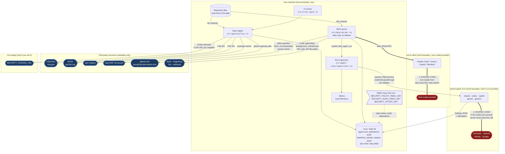

# Data flow and trust boundaries

Created: 2026-07-25
Last updated: 2026-07-25

This document answers one question precisely: **what leaves your machine, when, and to whom.**

A security tool that reads your repository is part of your trust boundary. Saying "it runs locally"
is not enough, because the interesting question is not where the process runs. It is which bytes
cross which line. Every edge below is labelled with what actually crosses it, and every claim here
is traceable to a file in `src/`.

For how the system is put together, see [ARCHITECTURE.md](ARCHITECTURE.md). For what it does not do,
see [LIMITATIONS.md](LIMITATIONS.md).

## The short version

security-mcp makes **no telemetry call** and **uploads no source code of its own**. Its own outbound
requests carry metadata only: CVE identifiers, dependency names, and finding counts.

Your source code still reaches a model provider by two routes, and you control both:

1. **The AI client you are already running it in.** security-mcp is an MCP server over stdio. When
   the host client calls `repo.read_file`, the file contents are returned as a tool result, and the
   host client sends that to whatever model provider you chose. security-mcp does not make that
   request. The content gets there all the same.
2. **A local agent CLI, only on an explicit agent run.** `orchestration.start_agent_run` spawns the
   agent CLIs installed on your machine. Each child makes its own outbound model call, which this
   server never sees. `ollama` stays local. This path is refused entirely when `SECURITY_OFFLINE`
   or `SECURITY_STRICT` is set.

Everything else is metadata or a download.

## Diagram

Red nodes receive source code. Blue nodes receive metadata only.

## Every outbound call, enumerated

| Caller | Destination | What crosses | Source code? |
| --- | --- | --- | --- |
| `src/gate/threat-intel.ts:53` | CISA KEV, `api.first.org` (EPSS) | CVE identifiers | No |
| `src/gate/checks/dependencies.ts:31` | `registry.npmjs.org` | dependency names | No |
| `src/gate/checks/dependencies.ts:44` | `api.securityscorecards.dev` | GitHub org/repo path | No |
| `src/cli/onboarding.ts:333` | `api.github.com` releases | nothing outbound | No |
| `src/cli/onboarding.ts:363` | `ALLOWED_BINARY_HOSTS` (line 355) | nothing outbound; downloads a binary, SHA-256 verified before use | No |
| `src/cli/update.ts:11,13` | npm registry, `raw.githubusercontent.com` | nothing outbound | No |
| `src/mcp/orchestration.ts:57,68` | `raw.githubusercontent.com`, npm registry | nothing outbound; downloads skills-manifest and SKILL.md | No |
| `src/mcp/server.ts:2382` | Slack webhook | `runId`, gate status, finding counts | No |
| `src/mcp/server.ts:2415` | `events.pagerduty.com` | `runId`, counts | No |
| `src/mcp/server.ts:2441` | `SECURITY_WEBHOOK_URL` | `runId`, `gateFailed`, counts, timestamp | No |
| `src/mcp/server.ts:2484` | your Jira instance | issue summary, counts | No |
| `src/gate/checks/ai-redteam.ts:307` | the endpoint URL you configured | DAST probe payloads | No |
| `src/gate/checks/nuclei.ts:103` | `SECURITY_STAGING_URL` | DAST probe traffic | No |
| **host AI client** | your model provider | **file contents**, as `repo.read_file` / `repo.search` tool results | **Yes** |
| **`src/agent-exec/executor.ts`** | each CLI's own provider | **code excerpts in the child's prompt** | **Yes** |

No entry in that table is a telemetry call. There is no usage reporting, no crash reporting, and no
call home of any kind.

## The two boundaries that carry source code

### Host AI client

This is the boundary most readers miss, because security-mcp is not the one making the request.

The server speaks MCP over stdio (`StdioServerTransport` in `src/mcp/server.ts`). It never opens a
network listener. When the host client invokes `repo.read_file`, the handler reads the file and
returns its contents in the tool result. The host client then includes that result in its next model
request. So on the first `repo.read_file`, your code is at your model provider.

This is inherent to running any MCP server inside an AI client. It is not a security-mcp behaviour
and security-mcp cannot prevent it. It is stated here because "runs locally" is otherwise read as
"your code stays local", and that reading is wrong.

Findings are redacted before they cross this line. Secret-scan matches become `[REDACTED]`
(`src/gate/checks/secrets.ts`), a hardcoded session secret is truncated to `prefix…suffix`
(`src/gate/checks/web-hardening.ts`), and an invisible-Unicode finding reports only the codepoint and
location, never the raw bytes (`src/gate/checks/emerging-supply-ai.ts`).

### Spawned agent CLIs

This boundary only exists after you call `orchestration.start_agent_run`. No agent runs implicitly,
and no outbound model call is made on any other path.

`orchestration.executor_status` reports what would happen, including which CLIs are detected and what
is blocking, at no token cost. Note that detection is not free of side effects: it runs each
candidate binary with its version flag to identify it. `security.fortify` calls `executor_status`, so
it too spawns those short-lived detection subprocesses. Nothing crosses the network on that path, but
local processes do start.

The supervisor launches the agent CLIs already installed and authenticated on your machine, per the
adapter registry in `defaults/agent-clis.json`. Each child assembles its own prompt containing code
excerpts and makes its own inference call. **security-mcp never sees that call**, which means it
cannot tell you what the child sent, and cannot redact it.

Controls on this boundary:

- **Credential passthrough is per adapter** (`buildChildEnv`, `src/agent-exec/executor.ts:137`). A
  Claude child has no business seeing a GitHub token, so it does not get one. The child environment
  is built with `extendEnv: false` from an allowlist rather than inherited.
- **Tools are least privilege** (`resolveTools`, `src/agent-exec/executor.ts:83`). Write tools are
  withheld unless the run is in `auto_apply`. Sub-agent-spawning tools are always denied.
- **Recursion is guarded.** A child gets the `child_readonly` tool profile, under which
  non-allowlisted MCP tools are not registered at all (`src/mcp/server.ts`).
- **Working state is confined.** Run directories are created `0700`, files `0600`.
- **`ollama` is local.** It is a completion-only adapter that does not leave the machine.

`docs/LIMITATIONS.md` states the residual risk plainly: under `auto_apply`, a child with write tools
is reading untrusted repository content, and prompt injection into that child is a real exposure.

## Cutting the network

`SECURITY_OFFLINE=1` opts out of all outbound calls. `SECURITY_STRICT=1` implies it and additionally
requires `SECURITY_POLICY_HMAC_KEY` and `SECURITY_AUDIT_HMAC_KEY` to be set (`src/config.ts:81`).

Under either flag:

- Threat intel is **skipped and recorded as a gap**, not reported as clean. A failed lookup and "no
  known-exploited CVEs" must never be the same value (`src/gate/threat-intel.ts:164`).
- Agent execution is **refused**, not silently degraded. Driving a local CLI necessarily makes an
  outbound model call, so `startAgentRun` declines with that reason
  (`src/agent-exec/supervisor.ts:206`, `src/agent-exec/tools.ts:39`).
- The host AI client boundary is **unaffected**. security-mcp cannot control what the client you are
  running it in does with a tool result. If that matters to you, use the CLI (`security-mcp scan`) or
  the CI gate (`npm run ci:pr-gate`) instead of the MCP server. Neither involves a model.

## Local state

Everything the tool remembers lives under `.mcp/` in your workspace: `agent-runs/`, `attestations/`,
`audit/`, `baselines/`, `policies/`, `reports/`, `sbom/`, and per-agent memory. Directories are
created `0700` and files `0600`.

Integrity of that state rests on HMAC keys supplied through the environment, never stored:
`SECURITY_POLICY_HMAC_KEY` (policy, exceptions, baseline), `SECURITY_AUDIT_HMAC_KEY` (the hash-linked
audit chain in `src/mcp/audit-chain.ts`), and `SECURITY_ATTEST_KEY` (agent attestations and persisted
reports). Without a key, the
recorded `sha256` is a recomputable integrity hash and nothing more: it detects accidental
corruption, not a motivated edit. `docs/LIMITATIONS.md` says the same thing and it is worth repeating
here, because an unsigned chain is tamper-evident, not tamper-proof.

## Change History

- 2026-07-25 - Created. Documents every outbound call in `src/`, the two boundaries that carry source
  code (host AI client, spawned agent CLIs), the offline cut points, and local state handling.
